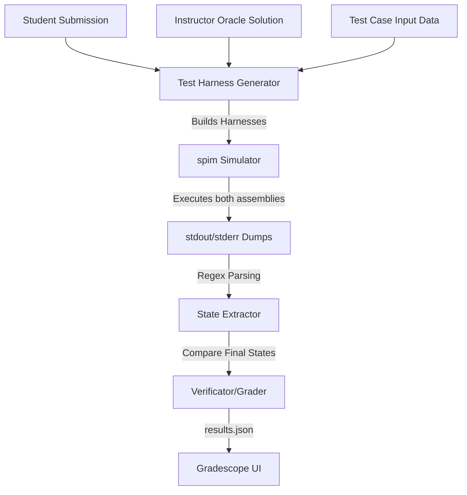

# MIPS Gradescope Autograder Guide

This repository contains the MIPS assembly autograders used for CSE 230 assignments. The grading environment replaces the traditional ZyLabs execution with a flexible, Docker-based autograder running the command-line **SPIM simulator** (the CLI equivalent of QtSpim).

This guide explains the technical architecture and details how to modify existing questions or create new ones.

---

## 1. Technical Architecture: Wrapper-Simulate-Verify

The autograders operate on a **Wrapper-Simulate-Verify** model. Rather than executing student code directly, the autograder dynamically wraps it with a robust testing framework:



1. **Wrapper (Build Harness)**: For each hidden test case, the Python driver `grader.py` compiles a complete MIPS assembly program (`test_harness.asm`). This harness:
   - Configures the `.data` segment (e.g., initial array values, linked lists).
   - Initializes input registers (`$s0`, `$s1`, etc.) in the `.text` segment.
   - Appends the student's MIPS instruction sequence (or the instructor's reference solution).
   - Prints the final state of modified registers and memory spaces using MIPS `syscall` instructions.
2. **Simulate (Run SPIM)**: The driver runs `spim -file harness.asm` for both the student submission and the instructor's reference solution.
3. **Verify (Compare & Grade)**: The driver parses the simulated stdout using regular expressions, extracts the final register/memory states, compares the student's output against the instructor's oracle output, and generates the Gradescope-compliant `results.json`.

---

## 2. Directory & File Organization

The repository is structured by assignment folders (`Zylab1` through `Zylab7`). Each folder is independent and contains the following files:

| File Name | Role |
| :--- | :--- |
| **`grader.py`** | Main autograder Python driver script. Defines the test cases, instructor solution, harness creation, SPIM executor, output parser, and grading logic. |
| **`MIPSSolution`** | Standalone file containing the instructor's reference MIPS solution. *(Note: This solution is also embedded inside `grader.py` as `PROF_SOLUTION`).* |
| **`Readme`** | The question-specific readme file summarizing the problem definition, inputs/outputs, grading criteria, and test case inputs for students. |
| **`setup.sh`** | Provisions the Gradescope Docker container by installing `spim` and `python3`. |
| **`run_autograder`** | Shell entry point script executed by Gradescope. It copies `grader.py` into the environment and launches it. |

---

## 3. Step-by-Step Guide: What to Change if a Question Changes

If you need to modify an existing question (or create a new one), follow these steps in the corresponding `Zylab` directory.

### Step 1: Update the Instructor's Reference Solution
You must update the reference MIPS solution in two places:
1. **`MIPSSolution` / `MIPSSolution.asm`**: Update this file with the new reference MIPS code.
2. **`grader.py` (`PROF_SOLUTION` string)**: Locate the multiline string `PROF_SOLUTION` at the top of the script and replace it with the new reference solution.

> [!WARNING]
> Ensure the instructor's solution is clean and does not include `.data`, `.text`, `.globl main`, or `main:` declarations unless the question specifically requires manual segment setup. It should only contain the MIPS instruction sequence.

### Step 2: Define/Update Hidden Test Cases
In `grader.py`, update the `TEST_CASES` list. The keys and structures should represent the inputs to your test cases:
```python
# Example for register/array based inputs (Zylab 2)
TEST_CASES = [
    {"name": "Test Case 1", "base": 4000, "size": 10, "array": [4, 8, -13, 8, -13, -13, 0, 8, 4, 0]},
    {"name": "Test Case 2", "base": 13804, "size": 4, "array": [-8, -4, 4, 8]}
]
```

### Step 3: Modify the Test Harness Generator (`build_harness`)
In `grader.py`, update the `build_harness(mips_code, ...)` function. This function constructs the assembly program executed by SPIM.
- **Initialize Input Data**: Insert test case variables into the harness's `.data` segment or load them into registers.
- **Memory Mapping (Pointer Safety)**: For pointers (such as in Linked Lists in Zylab 4 or Arrays in Zylab 3), students will use nominal addresses (e.g. `4000`, `8000`). You must map these nominal addresses to safe physical offsets within a large SPIM memory buffer (`__Memory: .space 20000`) to prevent memory-access exceptions.
- **State Printing**: Write MIPS assembly print routines using `syscall` at the end of the harness. The harness must print all register values and memory cells that are subject to grading.

### Step 4: Update Output Parsing
If the format of the output printed by the test harness changes, you must update the parser functions:
- **`parse_registers(spim_output)`**: Uses regex to extract registers from lines matching `(s0|s1|s2):\s*(-?\d+)`.
- **`parse_memory(spim_output)`** / **`parse_output(spim_output)`**: Uses regex to parse array contents or specific offset values.

### Step 5: Adjust Scoring and Verification Logic
Update the `grade_testcase` function to define how points are calculated. There are two primary models in use in this repository:
- **All-or-Nothing Grading**: Compares all values at once. If any register or memory location differs, the test case receives `0.0` points, otherwise `1.0` (used in Zylabs 2, 3, 4, 5).
- **Sub-point/Incremental Grading**: Grades each expected output independently. For example, in Zylab 1, 5 memory offsets are verified. Each correct offset contributes `0.2` points toward a maximum of `1.0` point per test case:
  ```python
  correct_count = sum(1 for i in range(2, 7) if student_values[i] == prof_values[i])
  score = round(correct_count * 0.2, 2)
  ```

> [!IMPORTANT]
> To protect the test case logic and avoid giving away solution details, `results.json` is generated with `"stdout_visibility": "hidden"`. Students will only see high-level **Pass** or **Fail** statuses in Gradescope. Full details/logs are printed to stdout, which is only visible to instructors and TAs.

### Step 6: Update Student-Facing Documentation
Update the local `Readme` file with:
- The new task description.
- A table of the updated hidden test cases.
- Submission requirements (e.g., instructing students *not* to include `.data` or `.text` wrappers).

---

## 4. Local Testing and Debugging

Before uploading the autograder to Gradescope, you can test it locally.

### Prerequisites
Ensure `spim` is installed and available in your shell's command path:
```bash
# macOS
brew install spim

# Ubuntu/Linux
sudo apt-get install spim
```

### Steps to Run Locally
1. In the target directory (e.g. `Zylab1`), create a local directory named `submission`:
   ```bash
   mkdir submission
   ```
2. Place a student MIPS assembly file (e.g., `submission.asm`) in that folder.
3. Run the python driver script:
   ```bash
   python3 grader.py
   ```
4. Check the generated grading results in `./results/results.json`.
5. Examine the instructor detailed terminal log output. The script prints out execution logs formatted like:
   ```text
   =================== INSTRUCTOR DETAILS ===================
   --- Test Case 1 ---
   Pass.
   Correct output size: 6
   Correct output array: [4, 8, -13, 0, 8, 4]
   ==========================================================
   ```

---

## 5. Deploying to Gradescope

To deploy an autograder to Gradescope:
1. Navigate to the specific assignment folder (e.g. `Zylab1`).
2. Create a zip archive containing:
   - `grader.py`
   - `setup.sh`
   - `run_autograder`
   - `MIPSSolution` *(optional but recommended for reference)*
   *(Do not zip the parent folder itself; zip the files directly).*
3. Upload the zip archive under **Autograder Settings** in the corresponding Gradescope assignment.
4. Let Gradescope build the Docker image (this runs `setup.sh` to install SPIM and configure Python).
